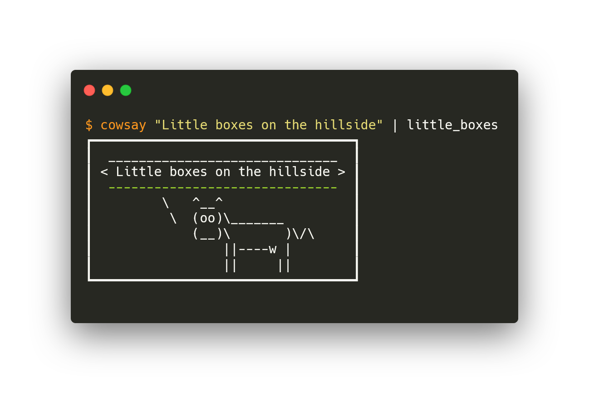

# Little Boxes
[](https://github.com/giodamelio/little_boxes/actions/workflows/rust.yml) [](https://crates.io/crates/little_boxes) [](https://github.com/giodamelio/little_boxes/blob/master/LICENSE) 

Adds boxes around stdin. Optionally adds a title.



# Installation

```sh
# From crates.io
$ cargo install little_boxes

# Try it out with Nix flakes
$ echo "Hello World" | nix run github:giodamelio/little_boxes
```

# Usage

```
little_boxes [options]

Options:
  -c, --charset <charset>    The charset to draw the box with [default: thick]
                             Available charsets: thick, thin, double, box, rounded and dot
  -t, --title <title>        Add a title to the box
  -a, --all                  Compare all the styles
  -h, --help                 Shows this help
  -v, --version              Show version
```
